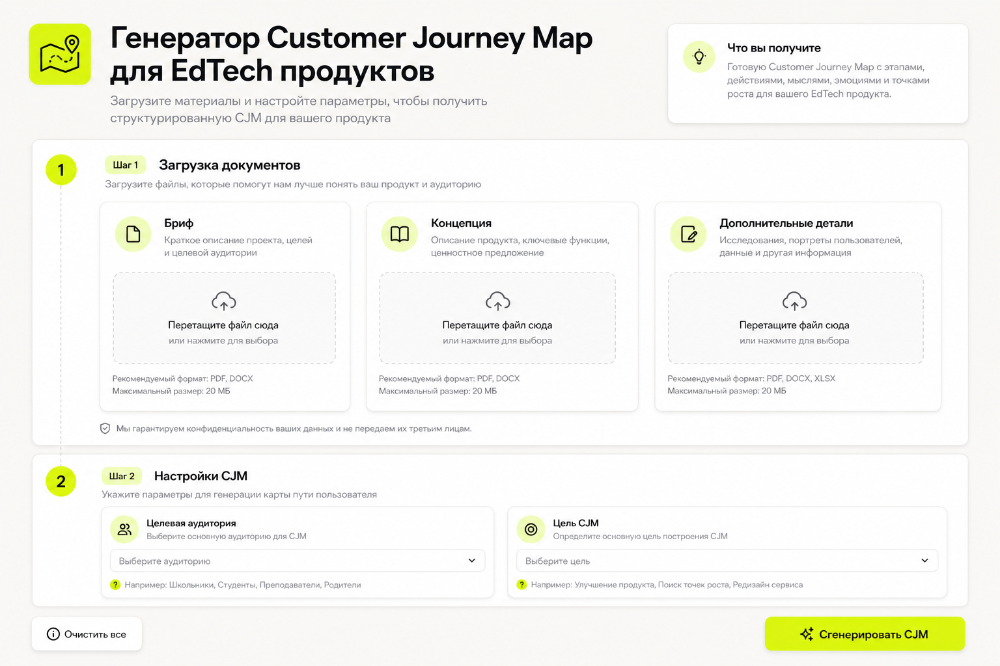
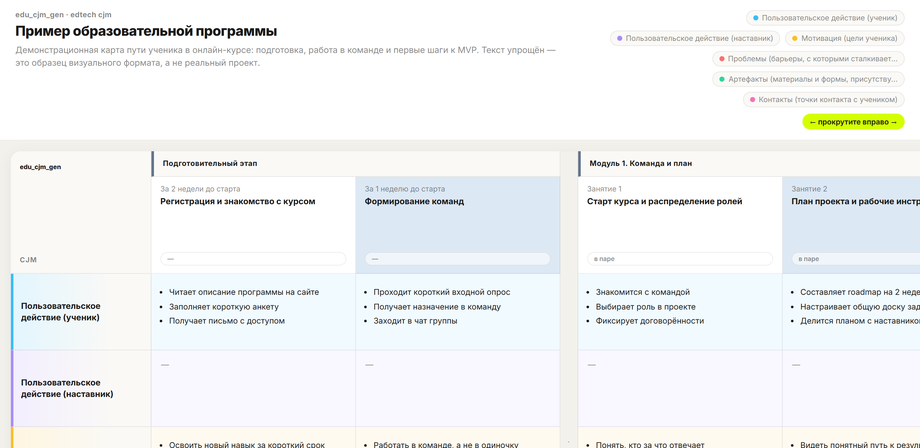
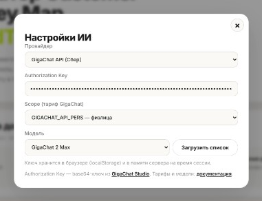
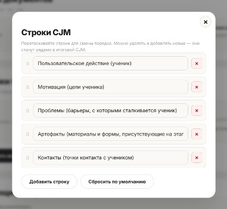

# 🗺️ EdTech CJM Generator

**Генератор Customer Journey Map для образовательных продуктов с интеграцией AI**

**Автор:** [Yury Mikhno](https://github.com/Duneholy)


---

<p align="center">
  
</p>

**EdTech CJM Generator** (`edu_cjm_gen`) — локальное веб-приложение для методистов, продакт-менеджеров и авторов EdTech-программ. Загрузите бриф и концепцию проекта, настройте структуру карты — и нейросеть синтезирует материалы, задаст уточняющие вопросы и соберёт **интерактивную CJM в HTML**, готовую к просмотру и передаче заказчику.

Работает через **OpenRouter** (Qwen и другие модели) или **GigaChat API** (Сбер).

---

## ✨ Ключевые возможности

* 📄 **Загрузка документов** — бриф, концепция и опционально дополнительные материалы. Форматы: `xls`, `xlsx`, `doc`, `docx`, `txt`, `md`.
* 🧩 **Гибкая структура CJM** — настраиваемые строки (действия ученика, наставника, артефакты, контакты…) и степень детализации столбцов (по модулям или по каждому занятию).
* 🤖 **AI-анализ материалов** — синтез документов, резюме программы и до 5 уточняющих вопросов по пробелам в данных.
* 🗺️ **Готовая интерактивная карта** — HTML-просмотрщик с цветовой кодировкой строк, группировкой столбцов по модулям/этапам, горизонтальной прокруткой и sticky-заголовками.
* 💾 **Экспорт** — открытие CJM в браузере или скачивание автономного `.html` файла.
* 🔒 **Local-first** — документы обрабатываются локально; на LLM уходит только синтезированный текст (не исходные файлы целиком).

<p align="center">
  
</p>

<p align="center"><sub>Демонстрационная карта с упрощённым текстом — не реальный проект.</sub></p>

---

## 🚀 Установка и запуск (Windows)

Для работы нужен **Python 3.10+**. Если Python не установлен, лончер покажет ссылку на [python.org/downloads](https://www.python.org/downloads/) — установите его вручную с галочкой **Add Python to PATH** и запустите `run_windows.bat` снова.

1. Склонируйте репозиторий или скачайте архив релиза.
2. Откройте папку проекта.
3. Запустите **`run_windows.bat`** двойным щелчком.

Скрипт автоматически:

* проверит наличие Python 3.10+ (команды `python` или `py -3`);
* создаст виртуальное окружение `.venv` (при первом запуске);
* обновит `pip` и установит зависимости из `requirements.txt`;
* освободит порт `5050`, если он занят старым процессом;
* откроет браузер на **http://127.0.0.1:5050**.

> **Остановка сервера:** нажмите `Ctrl+C` в окне терминала.  
> Если окно закрыли — освободите порт в PowerShell:
> ```powershell
> Get-NetTCPConnection -LocalPort 5050 -State Listen |
>   Select-Object -ExpandProperty OwningProcess -Unique |
>   ForEach-Object { Stop-Process -Id $_ -Force }
> ```

### Запуск вручную (Windows / macOS / Linux)

```bash
python -m venv .venv
# Windows:  .venv\Scripts\activate
# Unix:     source .venv/bin/activate
pip install -r requirements.txt
python run.py
```

Приложение будет доступно по адресу: **http://127.0.0.1:5050**

---

## ⚙️ Настройка AI

<p align="center">
  
</p>

Ключи хранятся **только в localStorage браузера** на вашем компьютере — не на сервере и не в облаке.

### OpenRouter (рекомендуется для старта)

1. Зарегистрируйтесь на [openrouter.ai](https://openrouter.ai/).
2. Создайте API-ключ в [настройках ключей](https://openrouter.ai/keys).
3. В приложении нажмите **«Настройки ИИ»** → выберите провайдер **OpenRouter**.
4. Вставьте ключ (`sk-or-v1-...`) и выберите модель, например:
   * `qwen/qwen3.7-plus` — быстрая и экономичная;
   * `qwen/qwen3-235b-a22b-instruct-2507` — более мощная.
5. Нажмите **Сохранить**.

### GigaChat API (Сбер)

1. Получите **Authorization Key** в [GigaChat Studio](https://developers.sber.ru/studio/workspaces) (раздел API / ключи).
2. В **«Настройки ИИ»** выберите **GigaChat**.
3. Вставьте Authorization Key и выберите модель, например **GigaChat-2-Pro**.
4. Укажите scope тарифа (`GIGACHAT_API_PERS` для физлиц или корпоративный — по вашему договору).
5. Тарифы и лимиты: [документация GigaChat](https://developers.sber.ru/docs/ru/gigachat/api/tariffs).

> 💡 **Совет:** при ошибках JSON или пустых вопросах попробуйте **GigaChat-2-Pro** или модель Qwen через OpenRouter.

---

## 📖 Как пользоваться

### Шаг 0 — Настройки ИИ

Нажмите **«Настройки ИИ»** в шапке → выберите провайдера, введите ключ и модель → **Сохранить**.

### Шаг 1 — Загрузка документов

| Файл | Обязательность | Содержание |
|------|----------------|------------|
| **Бриф проекта** | ✅ Да | Задачи, стейкхолдеры, целевая аудитория |
| **Концепция проекта** | ✅ Да | Модули, уроки, MVP, структура программы |
| **Дополнительные детали** | ➖ Нет | Всё важное, что не вошло в бриф и концепцию |

### Шаг 2 — Настройки CJM

<p align="center">
  
</p>

* **Строки CJM** — какие ряды будут в таблице (действия ученика/наставника, мотивация, проблемы, артефакты, контакты). Можно добавлять, удалять и переименовывать.
* **Столбцы CJM** — опишите детализацию: *«верхнеуровневая карта по 5 модулям»* или *«отдельный столбец на каждый из 22 занятий»*.

Нажмите **«Анализировать и задать вопросы»**.

### Шаг 3 — Уточняющие вопросы

ИИ покажет резюме программы и до **5 вопросов** по неясным местам. Ответьте на них — так карта получится точнее.

### Шаг 4 — Результат

Нажмите **«Собрать CJM»**. Затем:

* **Открыть CJM** — интерактивный просмотрщик в браузере;
* **Скачать HTML** — автономный файл для отправки коллегам;
* **Новая CJM** — начать заново.

Сгенерированные файлы сохраняются локально в папке `output/`.

---

## 🏗️ Архитектура

```
edu_cjm_gen/
  run.py                 # точка входа
  run_windows.bat        # запуск для Windows (вызывает launch.ps1)
  launch.ps1             # установка зависимостей и старт сервера
  backend/
    main.py              # сборка Flask-приложения
    routers/             # HTTP API (analyze, generate, models)
    services/
      document_parser.py # парсинг xls / docx / txt / md
      cjm_builder.py     # HTML-просмотрщик CJM
      cjm_rows.py        # конфигурация строк
      ai/                # OpenRouter + GigaChat
  frontend/
    index.html, styles.css
    js/                  # ES-модули (upload, step2, questions, …)
  output/                # сгенерированные HTML (gitignore)
  docs/images/           # скриншоты для README
```

**Стек:** Python · Flask · vanilla JavaScript (ES modules) · OpenRouter / GigaChat API

---

## 🔒 Безопасность

* **Local-first:** сервер работает только на `127.0.0.1`; данные проекта не покидают ваш компьютер, кроме текстов, отправляемых в LLM для анализа и генерации.
* **Ключи API** хранятся в `localStorage` браузера, не в файлах проекта.
* **Сессии** — в памяти процесса; после перезапуска сервера незавершённая CJM сбрасывается (сохранённые HTML в `output/` остаются).

---

## 🛠️ Требования

| Компонент | Версия |
|-----------|--------|
| Python | 3.10+ |
| Браузер | Chrome, Edge, Firefox (современный) |
| Интернет | Нужен для вызова LLM API |

---

## 📄 Лицензия

Проект распространяется под лицензией **MIT**. Подробности — в файле [LICENSE](LICENSE).

---

<p align="center">
  <sub>edu_cjm_gen © Yury Mikhno, 2026</sub>
</p>
